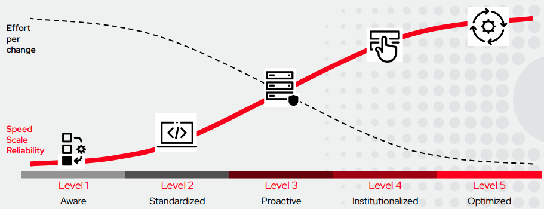

# Ansible Automation: Successful Onboarding 🎓  👍
This repository is a collection of thoughts 💡 intended to help customers with a successful Ansible Automation Platform adoption. ❗️ This repository is by no means a substitution for enterprises that require a full-blown consulting/services need. The focus is on SMEs that are looking for guidance to accelerate their Ansible Automation Platform journey 🏎 .

Maybe you noticed already that I didn't just say *Ansible adoption*. Let me quickly explain why that is: Ansible itself is just a tool, a tool is very limited and can never evolve into a wider strategy. Just as much as a hammer alone doesn't build a house. What you need is a toolkit - or what we call it: A platform. That is the big difference between using Ansible to automate some tasks and having a professional Automation strategy for your business.

An Automation journey involves 5 phases in my opinion, as seen below. The fact that you are here means that your are at least **Aware** that there is a need for a strategy. 



This document will help you to conquer Level 1-3 as they are the easiest to achieve and are achievable by any business in a relatively short period. The [Year 1 section](#year-1) will also include some tips on how to achieve Level 4 and 5.

## Table of Content

- [Introduction & Prerequisite Learning](#introduction--prerequisite)
    - [Official Red Hat Workshop (recommended)](#option-1-official-red-hat-workshops-recommended)
    - [Ansible Certifications from Red Hat (recommended)](#option-2-certifications-red-hat-recommended)
    - [Online Resources, example: Udemy](#option-3-online-resources-example-udemy)
    - [Self Learning (Docs)](#option-4-self-learning-docs)
    - [Jeff Geerling (creator & contributor)](#option-5-jeff-geerling-he-deserves-a-mention)
- [Preparation Tasks](#preparation-tasks)
    - [Who](#who)
    - [What](#what)
    - [When](#when)
    - [How](#how)
    - [Why](#why)
- [Day 1](#day-1)
    - [Authentication Methods](#authentication-methods)
    - [Inventories](#inventories)
    - [Credentials](#credentials)
    - [Source Control](#playbook-scm)
    - [Projects](#projects)
    - [Deliverable after Day 1](#deliverable-1)
- [Week 1](#week-1)
    - [Ansible Lint and Styleguide](#ansible-lint-and-styleguide)
    - [NodeJS App Deployment](#nodejs-app-deployment)
    - [Register Hosts with Red Hat Insights](#register-hosts-with-red-hat-insights)
    - [VMware Guide](#vmware-guide)
    - [AWS Guide](#aws-guide)
    - [Deliverable after Week 1](#deliverable-2)
- [Month 1 to 3](#month-1-to-3)
    - [Non-Production Tower Cluster](#non-production-tower-cluster)
    - [Integration with Ticketing/Self-Service Portal](#integration-with-ticketingself-service-portal)
    - [Roles, Collections and Automation Hub](#roles-collections-and-automation-hub)
    - [Deliverable after 3 Months](#deliverable-3)
- [Year 1](#year-1)
    - [Quo Vadis? (Where to?)](#quo-vadis)
    - [Automation Services Catalog](#automation-services-catalog)
    - [Level Up: Standards and Governance](#level-up-standards-and-governance)
    - [Level Up: Organizationally](#level-up-organizationally)
    - [Red Hat Health Check](#red-hat-health-check)
- [Appendix](#appendix)
    - [Official Red Hat Ansible Blog](#official-red-hat-ansible-blog)
    - [Ansible Automation for SysAdmins - A quickstart guide to Ansible](#ansible-automation-for-sysadmins---a-quickstart-guide-to-ansible)
    - [Company Success Stories and Exammples for Automation](#company-success-stories-and-exammples-for-automation)
    - [Sample AWS Playbooks](#sample-aws-playbooks)
    - [Collection of Blog Posts](#collection-of-blog-posts)
    - [Sample VMvare Playbooks](#sample-vmvare-playbooks)
    - [Getting Started with Windows Automation](#getting-started-with-windows-automation)
    - [Learning Ansible with CentOS7](#learning-ansible-with-centos7)
    - [Terraform and Ansible Example](#terraform-and-ansible-example)

# Introduction & Prerequisite 
I think that the most important thing for a successful automation journey is the planning phase. A well-planned automation 🧑‍🔬 journey will allow you to save time while a badly planned automation journey will likely simply introduce another tool that will eat away precious time in an already busy day 🙅‍♀️ . This repository is meant to help you with the planning and execution of a successful automation journey.

🔥 To do this, we will look at the tasks necessary before actually deploying Ansible & Ansible Tower, discuss some of the different deployment options as well as identifying targets for the first year.

Before you can get started, it is essential to gain a basic understanding of how Ansible works and how playbooks are written. There are a variety of sources available to you:

<hr>

## Option 1: Official Red Hat Workshops (recommended)
A variety of teams within Red Hat offer [monthly Ansible workshops](https://github.com/ansible/workshops) that you can attend free of charge. These workshops come in 5 different flavors, depending on your background and needs, my recommendation is the basic Red Hat Enterprise Linux Workshop as it offers a well-rounded curriculum:
-  **Ansible Red Hat Enterprise Linux Workshop** focused on automating Linux platforms like Red Hat Enterprise Linux
- **Ansible Network Automation Workshop** focused on router and switch platforms like Arista, Cisco, Juniper
- **Ansible F5 Workshop** focused on automation of F5 BIG-IP
- **Ansible Security Automation** focused on automation of security tools like Check Point Firewall, IBM QRadar, and the IDS Snort
- **Ansible Windows Automation Workshop** focused on automation of Microsoft Windows

To avail of this option, get in touch with your local account team. Keep in mind that this is good enough as a basic starting point, for full certification, look at the next option.

<hr>

## Option 2: Certifications Red Hat (recommended)
If you want the [best training on the market](https://www.ansible.com/products/training-certification) then there is no better option than this. Red Hat offers 7 different learning paths that will ensure that you are set up for success.
- [Microsoft Windows Automation with Red Hat Ansible](https://www.redhat.com/en/services/training/do417-microsoft-windows-automation-red-hat-ansible)
- [Advanced Automation: Ansible Best Practices](https://www.redhat.com/en/services/training/do447-advanced-automation-ansible-best-practices)
- [Red Hat System Administration III: Linux Automation with Ansible](https://www.redhat.com/en/services/training/rh294-red-hat-system-administration-iii-linux-automation)
- [Red Hat Certified Engineer (RHCE) exam for Red Hat Enterprise Linux 8](https://www.redhat.com/en/services/training/ex294-red-hat-certified-engineer-rhce-exam-red-hat-enterprise-linux-8)
- [Ansible Essentials: Simplicity in Automation Technical Overview](https://www.redhat.com/en/services/training/do007-ansible-essentials-simplicity-automation-technical-overview)
- [Ansible for Network Automation](https://www.redhat.com/en/services/training/do457-ansible-network-automation)
- [The Red Hat Certified Specialist in Advanced Automation](https://www.redhat.com/en/services/training/ex447-red-hat-certified-specialist-advanced-automation-ansible-best-practices-exam)

Each learning path is designed with a goal in mind. The optional certification that you can get at the end of each course carries real value as Red Hat certifications are one of the hardest to get in the IT industry. 
<hr>

## Option 3: Online resources, example Udemy
There are dozens of online resources available nowadays. If you prefer to learn at your own pace and you know that this way of learning works well for you - go ahead! I have used Udemy before and can recommend the following course: [Ansible for the Absolute Beginner - Hands-On - DevOps](https://www.udemy.com/course/learn-ansible/) as well as the advanced course [Ansible Advanced - Hands-On DevOps](https://www.udemy.com/course/learn-ansible-advanced/). I have no affiliation with Udemy or the creator.

<hr>

## Option 4: Self learning (Docs)
If you have experience with other automation tools such as Chef or Puppet and you like to just do your own thing, [skip to the docs and just get your hands dirty](https://docs.ansible.com/ansible/latest/user_guide/intro_getting_started.html). There is no reason why you wouldn't be able to do this, Ansible is straight forward in its application and requires a very minimal setup. The only problem here is that this option generally skips Ansible Tower.

<hr>

## Option 5: Jeff Geerling (he deserves a mention)
Jeff Geerling runs a [great blog and published dozens of videos on Ansible](https://www.jeffgeerling.com/blog/2020/ansible-101-jeff-geerling-youtube-streaming-series). He also published a book called [Ansible for DevOps](https://www.jeffgeerling.com/project/ansible-devops) that has sold >20.000 copies as of 2019. Jeff is a very vocal contributor to the Ansible Open Source project. I can recommend his content as his blogs helped me a lot when starting.

<hr>

# Preparation Tasks
Great, you have a basic understanding of Ansible and you know how to write playbooks. That alone would be sufficient to help you with personal projects or enable you to automate specific tasks during your day-to-day work. This of course not a strategy, nor does it scale particularly well. 

Your first step should be to get in touch with your Red Hat account team and discuss evaluation subscriptions, simultaneously you can follow the steps below. If you don't know who your account team is, you can reach [us here](https://www.redhat.com/en/contact) and someone will get in touch with you.

<hr>

## Who
The first question you need to answer is the *Who* question. Who do you want to include in your automation journey? Will it be mainly system administrators? Windows SysAdmins? Linux SysAdmins? Networking teams? Developers? Infrastructure? On-Prem and Cloud teams? 

This is the first step in my opinion. Others might disagree with this as one could argue that it is more important to identify the *What*. From my experience, both work just fine. I prefer to identify the people that need to be involved as it allows all involved parties to work together from the planning phase. The involved teams can then decide on *What is to be automated*. 

You should also start thinking about [Users](https://docs.ansible.com/ansible-tower/latest/html/userguide/users.html) and [Teams](https://docs.ansible.com/ansible-tower/latest/html/userguide/teams.html) within Tower. There is a designated [RBAC best practices section](https://docs.ansible.com/ansible-tower/latest/html/userguide/security.html#role-based-access-controls) in the Docs, make sure you read it - you don't need to understand everything in detail. If you are using Enterprise Authentication methods such as LDAP or SAML, it is also important that you look at the [relevant section in the docs](https://docs.ansible.com/ansible-tower/latest/html/administration/ent_auth.html).

Again, there is no need yet to apply these. But you should identify a strategy. 

<hr>

**You should be able to answer the following questions:**

- Who will be the core Ansible automation team in the first year?
- Who could extend the core team after this period?
- What RBAC model will be used? Do we need one? If you have only 3 users, the answer is likely *no*.
- Do we want to use LDAP, AD, or SAML for authentication?

<hr>


## What
Decide what you want to achieve. You can find inspiration [here](https://www.ansible.com/use-cases) and [here](https://www.ansible.com/integrations). Identify the tasks that you want to automate. This could be onboarding for new users, deploying VMs, configuring cloud VPCs, or maintaining networking equipment. **You should identify 10-20 small tasks for the first few weeks that you want to automate** - ❗️ important: Keep it realistic and don't overcomplicate things. Don't come up with something like *I want to automate our on-prem infrastructure*.

👌 Think especially of tasks that are time-consuming and error-prone.

Example Tasks:
- **Patching**: Request made, operation team logs into machine, applies the patch, reboots the server, validate service, closes change request.
- **Provisioning**: Dev Team requests VM, operation team deploys VM template, configures VM to organization standard, installs and configures requested software, passes off VM to Dev team, closes request.

<hr>

**You should be able to:**
- Identify 10-20 tasks that you want to deliver within the first month.
- Understand who will deliver these tasks.
- Expand each task into individual steps required to execute. 

<hr>

## When
It is important that you give yourself enough time ⏱️  to adopt your new automation tool. If you know that September and October are a busy time for your business, then delay the rollout until November. Don't put extra stress on yourself 🤒. Automation is meant to make your life easier, if you think of it *as just another thing that you need to do*, you will likely not succeed. 

<hr>

**Make sure that you can answer the following questions:**
- When will you rollout Ansible and Ansible Tower?
- Are there any roadblocks such as holidays or business disruptors during this rollout?
- Is everyone involved aware of the roadmap?
- Do you know how to reach Red Hat Support in case you encounter any technical problems?

<hr>

## Where
You should have a basic understanding of how [Inventories](https://docs.ansible.com/ansible/latest/user_guide/intro_inventory.html) work. And you have also identified what you want to automate. I would recommend spending some time identifying an Inventory strategy. There are a variety of ways to manage your inventories, my recommendation is to utilize [Dynamic Inventories](https://docs.ansible.com/ansible-tower/latest/html/userguide/inventories.html) in Ansible Tower. 

<hr>

**Identify a strategy that works for you to group hosts based on the tasks you have identified.** 

Examples:
- All RHEL hosts
- All Webservers within a specific VPC
- Windows Servers in AWS EU-West region

<hr>

## How
The only step left is to decide on the deployment method. Do you need a [highly available Ansible Tower deployment](https://medium.com/@florianmoss/highly-available-ansible-tower-deployment-on-aws-d95a0c42b1ef) or is a [basic deployment](https://medium.com/@florianmoss/installing-ansible-tower-on-rhel8-using-aws-ec2-c7ee2acad655?sk=b8a7e3d523f7ba3ff48699b344b7ecb1) sufficient? You can find all the [deployment options listed in the docs](https://docs.ansible.com/ansible-tower/latest/html/quickinstall/prepare.html).

I would recommend starting with a basic one machine deployment for smaller teams that manage up to 100 nodes. As long as you have 8-16GB RAM available and 100 GB of storage, you will be fine. If you will have >10 users and a couple of hundred nodes to manage - a [clustered approach](https://docs.ansible.com/ansible-tower/latest/html/administration/clustering.html#ag-clustering) will be the right decision. The steps for this are explained [here](https://medium.com/@florianmoss/highly-available-ansible-tower-deployment-on-aws-d95a0c42b1ef).

<hr>

## Why
👉 It is really important to remind yourself why you did all of this. Your main goals are to save money, time, and remove sources for errors. All those questions you answered so far will help you to do this. 

<hr>

# Day 1
Today is the big day 🥳, go ahead and deploy your Ansible Tower instance/-s. Implement your authentication model and setup RBAC as you have planned. Then go ahead and set up your inventory, credentials, and projects. It is essential to get these Day 1 tasks right, as it will determine how successful the first 2 weeks will be. If you spent time on the preparation tasks and came up with a strategy, then there is no reason why you should encounter any roadblocks today.

❗️ Don't forget to [personalize Ansible Tower with a custom logo and login message](https://docs.ansible.com/ansible-tower/latest/html/administration/custom_rebranding.html). 

<hr>

## Authentication Methods
You will have identified how you want to manage Ansible Tower users. The following options are available to you - simply follow the instructions based on your preference:
1. [Username and Password Login](https://docs.ansible.com/ansible-tower/latest/html/userguide/users.html)
1. [Token Based Authentication: OAuth2](https://docs.ansible.com/ansible-tower/latest/html/administration/oauth2_token_auth.html)
1. [Social Authentication: GitHub & Google](https://docs.ansible.com/ansible-tower/latest/html/administration/social_auth.html)
1. [Enterprise Authentication: AD, LDAP, RADIUS, SAML](https://docs.ansible.com/ansible-tower/latest/html/administration/ent_auth.html)
<hr>

## Inventories
You can start with a [static inventory](https://docs.ansible.com/ansible-tower/latest/html/userguide/inventories.html) if there are <100 hosts and there is little volatility for your hosts and hostnames. On the other hand, a [dyanamic inventory](https://docs.ansible.com/ansible-tower/latest/html/userguide/inventories.html#inventory-plugins) will allow for greater flexibility and allow you to scale out. 

It's not difficult to switch from static to dynamic inventories later on. Don't worry if you struggle with [custom inventory scripts](https://docs.ansible.com/ansible-tower/latest/html/administration/custom_inventory_script.html), just make sure you have the hosts setup that you identified for your initial tasks. That's the minimum goal.

<hr>

## Credentials
Set your [credentials](https://docs.ansible.com/ansible-tower/latest/html/userguide/credentials.html) for private SCM repositories and your hosts. I recommend deploying public keys on the target hosts and storing the private key as a credential. Never use passwords if avoidable.

<hr>

## Playbook SCM
For the first 3 months, a single repository that contains all playbooks is sufficient, for most users. If you have different teams that manage vastly different environments, find a model that works for you. You could create one repository that manages all Linux machines, one that manages all networking equipment, one for Windows hosts, etc. 

<hr>

## Projects
Set up a [project](https://docs.ansible.com/ansible-tower/latest/html/userguide/projects.html) within Tower for each of those repositories. Make sure that the right users and teams have access to those projects.

<hr>

## Deliverable 1
You should now have a running Ansible Tower deployment with access to 1 or more repositories to manage your playbooks, as well as access to your target hosts either via static inventories or dynamic inventories through the credentials that you have set up.

You are now ready to do actual work!

<hr>

# Week 1
You have identified some basic tasks that you would like to automate. Start with those tasks. To accelerate your execution, this section contains some sample playbooks. You can find the playbooks in the Week1 folder.

<hr>

## Ansible Lint and Styleguide
Now that you're starting to write real playbooks, it is important to get things right  🙏. For that reason, I would recommend using the [Ansible Linter](https://ansible-lint.readthedocs.io/en/latest/).  The [following style guide](https://github.com/whitecloud/ansible-styleguide) is outdated but could work as a baseline for your company. Just trust me on this one. Without a style guide, things will get out of hand and things get unmaintainable over time. I've learned that lesson the hard way myself  😓.

<hr>

## NodeJS App Deployment
This [playbook deploys a NodeJS application](https://github.com/florianmoss/ansible-successful-onboarding/tree/master/week1/nodeJS) with forever. It uses a single variable that is specified at the beginning of the playbook.

<hr>

## Register Hosts with Red Hat Insights
This [playbook](https://github.com/florianmoss/ansible-successful-onboarding/tree/master/week1/tower-insights-template) demonstrates how Collections can be configured and used within Ansible Tower.

<hr>

## VMware Guide
The integration between Ansible is VMware is quite extensive. The official Ansible documentation contains an [entire section around Ansible for VMware](https://docs.ansible.com/ansible/latest/scenario_guides/guide_vmware.html). 
You can also get the [collection source code](https://github.com/ansible-collections/vmware.vmware_rest) directly.

Pick a simple use case and make it work. For example, look at the [vmware_guest module](https://docs.ansible.com/ansible/latest/collections/community/vmware/vmware_guest_module.html) and use it to create a virtual machine on an ESXi host:

```yaml
- name: Create a virtual machine on given ESXi hostname
  community.vmware.vmware_guest:
    hostname: "{{ vcenter_hostname }}"
    username: "{{ vcenter_username }}"
    password: "{{ vcenter_password }}"
    validate_certs: no
    folder: /DC1/vm/
    name: test_vm_0001
    state: poweredon
    guest_id: centos64Guest
    # This is hostname of particular ESXi server on which user wants VM to be deployed
    esxi_hostname: "{{ esxi_hostname }}"
    disk:
    - size_gb: 10
      type: thin
      datastore: datastore1
    hardware:
      memory_mb: 512
      num_cpus: 4
      scsi: paravirtual
    networks:
    - name: VM Network
      mac: aa:bb:dd:aa:00:14
      ip: 10.10.10.100
      netmask: 255.255.255.0
      device_type: vmxnet3
    wait_for_ip_address: yes
    wait_for_ip_address_timeout: 600
  delegate_to: localhost
  register: deploy_vm
```
<hr>

## AWS Guide
Ansible has extensive integration with AWS. You can find a [quick start guide here](https://docs.ansible.com/ansible/latest/scenario_guides/guide_aws.html). Deploying an EC2 instance is as simple as:
```yaml
- hosts: localhost
  gather_facts: False

  tasks:

    - name: Provision a set of instances
      ec2:
         key_name: my_key
         group: test
         instance_type: t2.micro
         image: "{{ ami_id }}"
         wait: true
         exact_count: 5
         count_tag:
            Name: Demo
         instance_tags:
            Name: Demo
      register: ec2
```
AWS offers hundreds of products. Pick something relevant to you, such as backing up a database, deploying a new user to an EC2 instance, or a developer self-service for development and testing purposes.

<hr>

## Deliverable 2
At this stage, you should have a few playbooks that help you with the automation of basic tasks. It is important that you take some time now to review how the first week went. Were there any roadblocks? Is everyone confident when it comes to the basics: Can you write playbooks, use roles, use collections, apply variables when needed, etc.

Some advice from experience: Don't pull the *Java programmer* behavior and try to modularize all of your playbooks in the beginning. **Make sure that they do what you want them to do. You will be able to review them at a later stage.** In the first week it's much more important to get started and deliver playbooks that help you automate stuff.

You must identify what you want to do for the following 12 weeks.

<hr>

# Month 1 to 3
This is arguably the most exciting stage as you are now an advanced Ansible Automation team and you can start pushing the boundaries. Make sure that you truly understand the core concepts and more advanced ones such as:
- [Conditionals](https://docs.ansible.com/ansible/latest/user_guide/playbooks_conditionals.html)
- [Privilege Escalation](https://docs.ansible.com/ansible/latest/user_guide/become.html)
- [Playbook Troubleshooting](https://docs.ansible.com/ansible/latest/user_guide/playbooks_startnstep.html)
- [Templating (Jinja2)](https://docs.ansible.com/ansible/latest/user_guide/playbooks_templating.html)
- [Error Handling](https://docs.ansible.com/ansible/latest/user_guide/playbooks_error_handling.html)

There are of course a lot more things that you can learn. But don't worry, you will pick them up over time. It is much more important to identify tasks that you want to automate and deliver them.

If you need more inspiration on what to automate, have a look [here](https://www.ansible.com/use-cases) or [here](https://www.ansible.com/integrations).

<hr>

## Non-production Tower cluster
Look at your current usage and evaluate the need for a non-production Tower cluster. This is often used in larger enterprises but it could also make sense for an SME depending on the usage and criticality of hosts that are managed.

<hr>

## Integration with Ticketing/Self-Service Portal
[ServiceNow offers great integration](https://github.com/ServiceNowITOM/servicenow-ansible) with Ansible. There is a [fantastic blog post](https://www.ansible.com/blog/ansible-servicenow-howto-part-3-making-outbound-restful-api-calls-to-ansible-tower) that helps you with a step-by-step guide setting all of this up.

You could also write a simple web-app that makes use of the Tower API, this is especially useful if HR is looking to automate the onboarding process for a new employee. 

There are no limits. Again, start small and roll with it.

<hr>

## Roles, Collections and Automation Hub
You should be able to use and apply [roles](https://docs.ansible.com/ansible/latest/user_guide/playbooks_reuse_roles.html) and [collections](https://docs.ansible.com/ansible/latest/user_guide/collections_using.html). Now is also a good time to look into rewriting some of the more complex playbooks and refactor them as roles or even collections. 

Make sure that you understand the [Ansible Automation Hub](https://cloud.redhat.com/ansible/automation-hub) and all of its benefits, such as *Automation Analytics* or the *private Automation Hub*.

<hr>

## Deliverable 3
At the end of these 3 months, all of your initial set tasks should be completed ✅. You should have some roles written and modularized some of the more complex playbooks. Meet with the core Ansible team and review your experiences and decide on a strategy for the following 9 months. 

* Are there any issues❓ 
* Do you need more resources❓
* What went well, what didn't go well❓ 
* Who is using Ansible, is there a need to include other teams❓

<hr>

# Year 1
This is simple: Keep reviewing what you are doing and identify milestones. Set specific targets. Don't fall into the trap of sating 'yeah we will automate stuff'. What are you going to automate and why? Be as specific as possible.

Now is also a good time to think about on-boarding for new Ansible users in your company. Come up with a learning and on-boarding process for core users and identify a documentation and maintenance strategy. 

How do you share playbooks between multiple teams? Are playbooks properly documented? Are there obsolete playbooks? 

<hr>

## Quo Vadis?
Ansible excels as an automation tool because it plays so well with other tools such as Terraform and ServiceNow. My recommendation would be to explore the integration with those tools to achieve an **Everything as Code** state. 

A great example is Terraform + Ansible. Terraform excels at being an Infrastructure as Code tool. Especially for complex environments. Ansible on the other hand is fantastic at configuring these environments. Why not combine both?

**Some examples:**


*The Right Way to DevOps with Terraform and Ansible*

[](https://www.youtube.com/watch?v=AsPIKWF1y_M)

<hr>

*Ansible and HashiCorp: Better Together*

[](https://www.youtube.com/watch?v=-gKTeT3BgHE)

<hr>

## Automation Services Catalog

The [Automation Services Catalog](https://www.ansible.com/products/automation-services-catalog) is probably my favorite feature added in 2020 to the Ansible Automation platform. It is basically a mini ServiceNow system for your playbooks.

Imagine the following: The Dev team wants to get a VM with specific specifications. All they need to do is fill out a form and send it off. A manager can then review and approve the request and off you go - the job will run and send out a notification to the dev team with the machine credentials. 

There is much more in it of course, but that's the just of it. 

<hr>

## Level Up: Standards and Governance

You have mastered Level 3 on the initial graphic. But how do you reach Level 4 or even 5? 

Standards and Governance are hugely important as they will make your life significantly easier over time. Most of these items are common sense and should already be practiced - but it is important to review them item by item and have a reality check with your teams. The more you scale up your automation strategy, the more important structure becomes.

- Repository structure, code standards, documentation, and reuse mechanisms (collections/roles/Automation Hub).
- Standardized testing and CI approaches for new playbooks.
- Identify and utilize sources of truth - or start building them.
- Automate content release process, deployments, and lifecycle.
- Operationalize your automation, considering access control, scale, and auditing/visibility.

<hr>

## Level Up: Organizationally

This is the final boss and the hardest beast to tackle - the larger your organization, the worse this one becomes. Organizational change. Such an over-used term, I know. But it is true: If you want to have an **Organization-Wide Automation Strategy**, you need to bring the whole organization on board with you.

So how exactly can you increase adoption across silos?

- Socialize and enforce the standards and governance mentioned earlier.
- Charter and empower an Automation team with vision across the organization. 
- Establish **your** Automation platform and simplify onboarding.
- Expand Ansible integrations in support of end-to-end automation.
- Identify and track metrics and KPIs within Automation Hub. Focus on outcomes.

## Red Hat Health Check
Get in touch with your account team as early as possible to discuss your experiences from the past few months and look at your renewal. Do you need more nodes to manage? Would you like to engage the Red Hat Services team to improve your workflow? 

<hr>

# Appendix
This is meant to be a collection of interesting documents and blogs that might be helpful.

## Official Red Hat Ansible Blog
[Link to Website](https://www.ansible.com/blog)

## Ansible Automation for SysAdmins - A quickstart guide to Ansible
[Document Link](https://github.com/florianmoss/ansible-successful-onboarding/blob/master/appendix/ansible_automation_for_sysadmins_v2.pdf)

## Company Success Stories and Examples for Automation
[Document Link](https://github.com/florianmoss/ansible-successful-onboarding/blob/master/appendix/The_automated_enterprise-_Unify_people_and_processes-1.pdf)

## Sample AWS Playbooks
[GitHub Repository: Pat Harrison (Domain SA Red Hat)](https://github.com/pharriso/ansible-aws)

## Collection of Blog Posts
[Pat Harrison - Cloud Automation Blog](https://cloudautomation.pharriso.co.uk/)

## Sample VMvare Playbooks
[GitHub Repository: Pat Harrison (Domain SA Red Hat)](https://github.com/pharriso/ansible-vmware)

## Getting Started with Windows Automation
[Geekflare Blog Post](https://geekflare.com/ansible-playbook-windows-example/)

## Learning Ansible with CentOS7
[Blog Post by Bradley Simonin](https://medium.com/@brad.simonin/learning-ansible-with-centos-7-linux-12461043fd02)

## Terraform and Ansible Example
[Blog Post: Writing Ansible Playbooks for New Terraform Servers](https://victorops.com/blog/writing-ansible-playbooks-for-new-terraform-servers)
